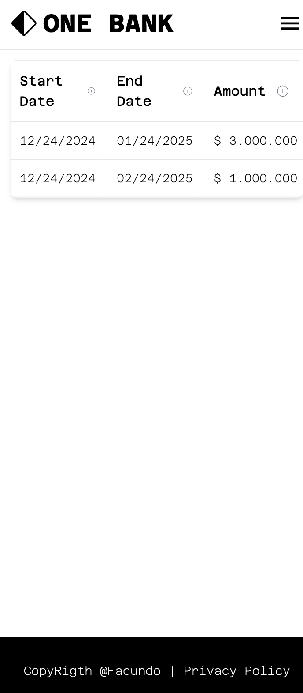

# Virtual Investment Project

This project uses Docker to containerize a fullstack application that includes a Node.js backend and frontend. It also utilizes PostgreSQL as the database.

## Prerequisites

Make sure you have the following installed:

Docker
Docker Compose

## Project Structure

```sh
.
├── Backend
│   ├── Dockerfile
│   ├── package.json
│   └── src
│
├── Frontend
│   ├── Dockerfile
│   ├── package.json
│   └── src
│
├── DataInit
│   └── init.sql
│
└── docker-compose.yml

```

## Configuration

1. Database Configuration: Make sure to update the docker-compose.yml file with your database credentials in the db section:

```bash
environment:
  POSTGRES_USER: postgres
  POSTGRES_PASSWORD: 12345

```

2. Database Initialization: The database is automatically set up using the .init.sql file located in the db/init folder. 

This file contains the necessary instructions to create and configure the required tables, ensuring the environment is ready for use without any additional manual setup

## Running the Project

To start the project, follow these steps:

1. Open a terminal in the root of the project (where the docker-compose.yml file is located).

2. Run the following command to build and start the containers:

```bash
docker-compose up --build
```

3. Access the application:

- Frontend: Open your browser and go to http://localhost (port 80).
  \*Backend: Access the API at http://localhost:3000.

## Useful Commands

1. To stop the containers:

```bash
docker-compose down -v
```

2. To restart the containers:

```bash
docker-compose restart
```

3. To view the logs of the containers:

```bash
docker-compose logs -f
```

## Database diagram


## Video

[Click here to watch the demo video](./media/VideoDemo.mp4)

## Images

Web app


Mobile app





